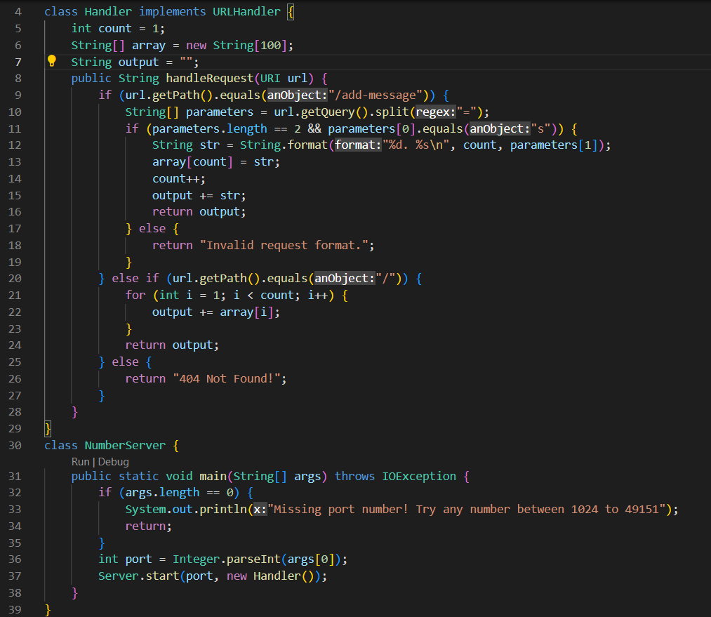
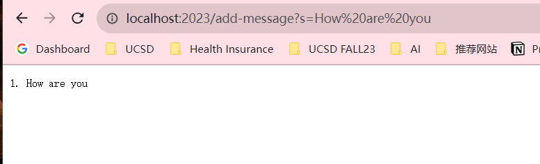
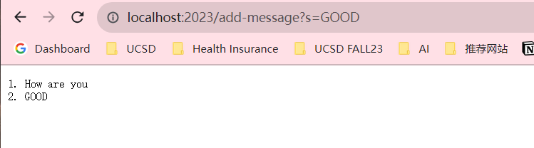

# Lab Report 2

### `StringServer`

### `/add-message`

`handleRequest` in the `Handler` class and `main` method in the `NumberServer` class are called.
After the URL was generated, I added the path `/add-message` and the query `?s=How are you`. The query uses the correct format to add a string and its component contains the message I want to add, which is "How are you." 
As a result, `currentCount` was updated to `1`, indicating the count of messages and `output` was updated to `"1. How are you"` to display the added message in a webpage.

`handleRequest` in the `Handler` class is called.
The URL has the same path `/add-message` but a different query `?s=GOOD`. 
`currentCount` was updated to `2` to reflect that two messages have been added and `output` was updated to `"1. How are you\n2. GOOD\n"` to display both added messages in the order they were added.
This is because the `handleRequest` method handles the requests by parsing the URL, extracting the message from the query, and updating the message list and the count accordingly. The path remains the same (`/add-message`), but the query component changes to specify the message to be added. The `/add-message` path allows me to add messages to the list, and the count is incremented with each new message added.

### private key

### public key

During the lab sessions, I learned more about SSH and server creation. SSH enabled me to establish secure connections with remote computers, which will be useful for accessing better hardware. Moreover, learning to create a server was exciting because it provided an interactive platform that I could build upon to create more useful servers. This week's lessons on paths, SSH, and public-private key authentication make accessing servers without traditional password authentication possible, which are skills essential for both current coursework and future projects.
