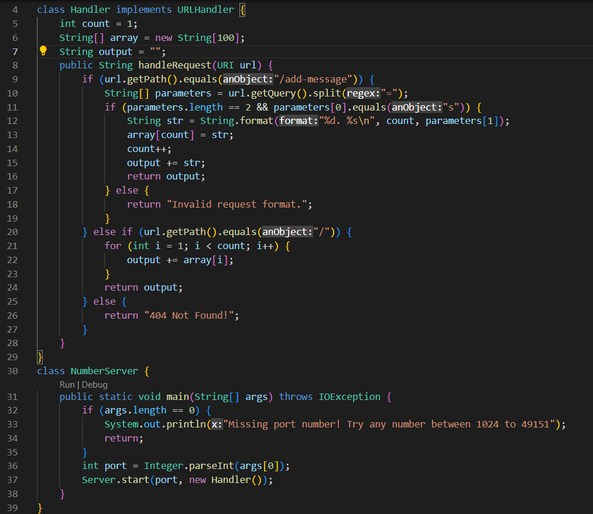

# Lab Report 2

### `StringServer`


```
import java.io.IOException;
import java.net.URI;

class Handler implements URLHandler {
    int count = 1;
    String[] array = new String[100];
    String output = "";
    public String handleRequest(URI url) {
        if (url.getPath().equals("/add-message")) {
            String[] parameters = url.getQuery().split("=");
            if (parameters.length == 2 && parameters[0].equals("s")) {
                String str = String.format("%d. %s\n", count, parameters[1]);
                array[count] = str;
                count++;
                output += str;
                return output;
            } else {
                return "Invalid request format.";
            }
        } else if (url.getPath().equals("/")) {
            for (int i = 1; i < count; i++) {
                output += array[i];
            }
            return output;
        } else {
            return "404 Not Found!";
        }
    }
}
class NumberServer {
    public static void main(String[] args) throws IOException {
        if (args.length == 0) {
            System.out.println("Missing port number! Try any number between 1024 to 49151");
            return;
        }
        int port = Integer.parseInt(args[0]);
        Server.start(port, new Handler());
    }
}
```

### `/add-message`


`handleRequest` in the `Handler` class is called
This method handles incoming HTTP requests based on the path of the URI.

If the path is /, it returns "String Server Running".

If the path contains /add-message, it processes the query parameters to add a message to the info field and returns the updated messages.

For any other path, it returns "404 Not Found!".


When the /add-message endpoint is called with a query parameter like ?s=How are you,
handleRequest(URI url) is called with a URI object representing the new URI(“http://localhost:4000/add-message?s=Hello”).
getQuery() split the s=Hello into parameter[0] = s and parameter[1] = "How%20are%20you"

`url`: A URI object representing the URL "http://localhost:4000/add-message?s=How are you".

`count`: Initially 1

`output` & `array`: Initially “”

Field Changes:

`output`: This field will concatenate the current value of num, the received message, and a newline character. If the initial value was “” and num was 1, it becomes "1. Hello\n".

`count`: This field increments by 1.

As a result, `count` was updated, indicating the count of messages, and `output` was updated to `"1. How are you"` to display the added message in a webpage.


`handleRequest` in the `Handler` class is called.
The URL has the same path `/add-message` but a different query `?s=GOOD`. 

This is because the `handleRequest` method handles the requests by parsing the URL, extracting the message from the query, and updating the message list and the count accordingly. The path remains the same (`/add-message`), but the query component changes to specify the message to be added. The `/add-message` path allows me to add messages to the list, and the count is incremented with each new message added.

getQuery() split the s=Hello into parameter[0] = s and parameter[1] = "good"

`url`: A URI object representing the URL "http://localhost:4000/add-message?s=good".

`count`: 2

`output` & `array`: “1. Hello\n”

Field Changes:

`output` & `array`: Concatenates "2. good\n" to the existing messages, becoming "1. How are you\n2. good\n"

`count`: Increments to 3.


### private key


### public key


During the lab sessions, I learned more about SSH and server creation. SSH enabled me to establish secure connections with remote computers, which will be useful for accessing better hardware. Moreover, learning to create a server was exciting because it provided an interactive platform that I could build upon to create more useful servers. This week's lessons on paths, SSH, and public-private key authentication make accessing servers without traditional password authentication possible, which are skills essential for both current coursework and future projects.
